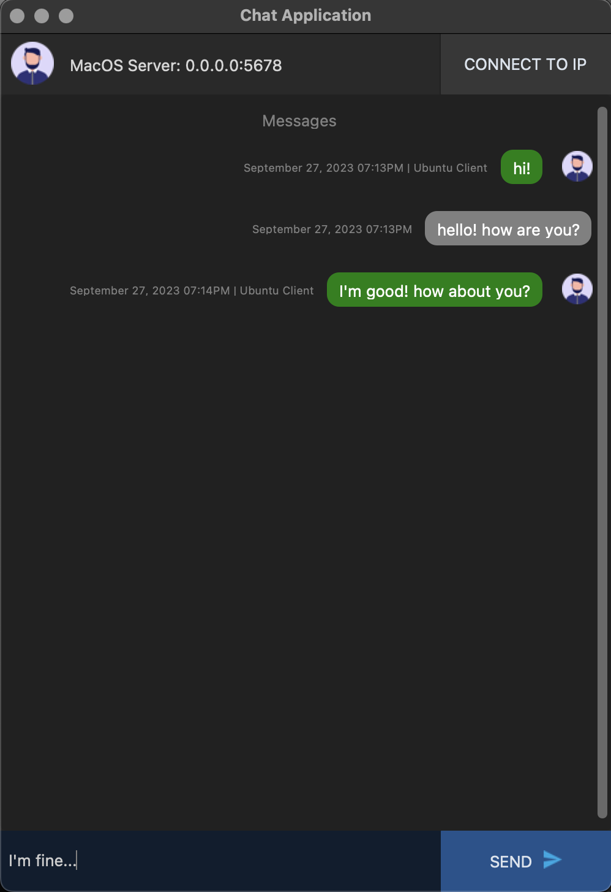
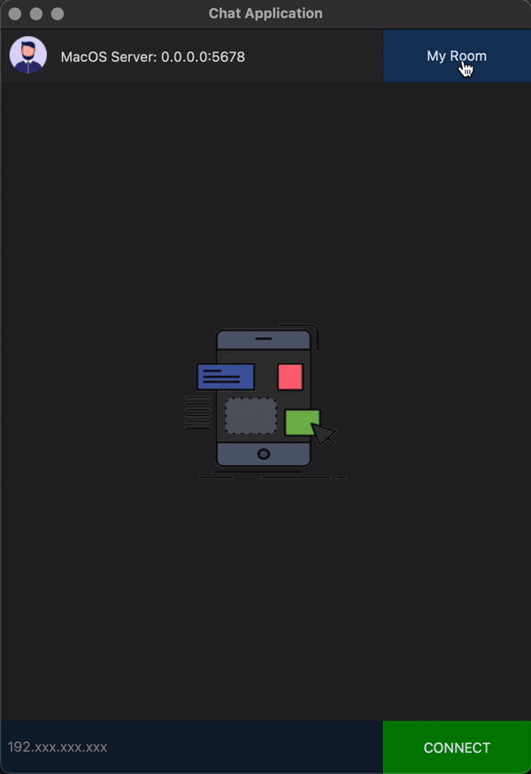
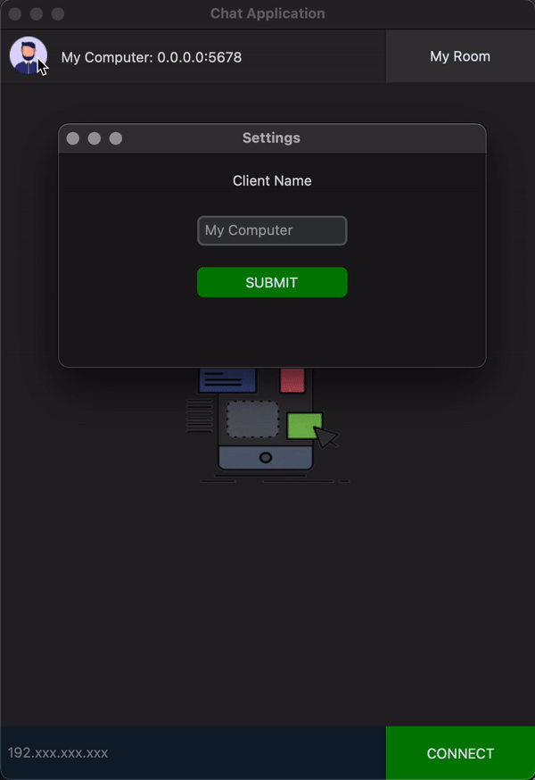

# Python Chat Application via Socket
This project is for the completion of the `Laboratory Exercise #1` and `Laboratory Exercise #2` for `IT 238 - Network and Client/Server Computing`.   



## Exercise #1 
Simple Client-Server Chat application using Python TCP/IP Socket Programming.

### Program Description: 
The server process runs on your Linux machine that waits for a client to establish a `TCP/IP connection`. The client may run on your laptop or any other client device with a network connection to your server. Once a connection is established, the client/server may send chat messages between each other. Display in a scrolling screen the exchange of messages. Messages are entered in a message entry box and are sent as a stream after pressing the `<enter>` key. Pressing `<ctrl-x>` will terminate the program.

## Exercise #2 
Multiple Client to one Server Chat application using UDP Broadcast

### Program Description: 
 Extend your simple client-server chat application in `Lab Exer 1` to allow multiple clients to join in the chat (or bulletin board). Clients establish a connection with the server by registering a name. The server receives text message streams from the client and sends a copy of the `message to all other clients by IP broadcast`. All chat screens must be the same for all clients and servers. 


## Dependencies
* python3
* python3-tk
* customtkinter
* Pillow
* python-dotenv

## Starting the Application via Command Line Interface (CLI)
```bash
  python3 ./src/app/main.py
```

## Download Executable Package
Binary package for both `TCP` and `UDP` are included on pre-release builds.

[MacOs v12.4 (Apple Silicon M1)](https://github.com/jkga/py_chat_tcp/releases/tag/0.1)   
[Ubuntu v22.04LTS](https://github.com/jkga/py_chat_tcp/releases/tag/0.2)

## Network Connection
To change the default connection from `TCP` to `UDP`, edit the configuration in `.env` file
```env
  CONNECTION_TYPE=TCP
```
Server Options
> TCP | UDP

## User Interface

### Shifting from Server to Client
The software can act as a `server` and a `client` simultaneously. 




### Custom Client/Server Name
Your name will be visible to all connected clients but will not affect the previous messages




## Notice
- The software supports both `TCP` and `UDP`
- Built-in server will start automatically once you open the software depending on the `CONNECTION_TYPE` specified in  `.env` file
- Both connection types support multiple connections
- You `MUST` wait until the IP address and port is `free` from the previous `TCP` connection, otherwise, you will receive an `address` error
- You can still use the software as a chat `client` even in the event where the built-in server is not running
- The developer used the `pyinstaller` module to create distributable packages fo various operating systems

## To Do
- Make a window option for selecting a connection type `(TCP|UDP)`, instead of setting the configuration from runtime
- add support for different colors of chat bubbles
- Add support for choosing an avatar